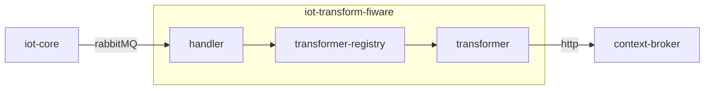

# iot-transform-fiware
A service for handling core functionality in the IoT platform

[](https://github.com/diwise/iot-agent/blob/main/LICENSE)

# Design



## Dependencies  
 - [iot-device-mgmt](https://github.com/diwise/iot-device-mgmt)
 - [RabbitMQ](https://www.rabbitmq.com/)
 - [Context Broker](https://github.com/diwise/context-broker)
## Transformers
Transformers purpose is to transform measurements into [Smart Data Models](https://smartdatamodels.org/) (FIWARE). Additional transformers could easily be developed using the context-broker client api and [decorator functions](https://github.com/diwise/context-broker/blob/main/pkg/ngsild/types/entities/decorators/decorators.go). 
### AirQualityObserved
[Specification](https://github.com/smart-data-models/dataModel.Environment/blob/master/AirQualityObserved/doc/spec.md)

An observation of air quality conditions at a certain place and time.
### IndoorEnvironmentObserved
[Specification](https://github.com/smart-data-models/dataModel.Environment/blob/master/IndoorEnvironmentObserved/doc/spec.md)

An observation of air and climate conditions for indoor environments.
### GreenspaceRecord
[Specification](https://github.com/smart-data-models/dataModel.ParksAndGardens/blob/master/GreenspaceRecord/doc/spec.md)

This entity contains a harmonised description of the conditions recorded on a particular area or point inside a greenspace (flower bed, garden, etc.).
### Device
[Specification](https://github.com/smart-data-models/dataModel.Device/blob/master/Device/doc/spec.md)

An apparatus (hardware + software + firmware) intended to accomplish a particular task (sensing the environment, actuating, etc.).
### Lifebuoy
[Specification]()

Custom Smart Data Model
### WeatherObserved
[Specification](https://github.com/smart-data-models/dataModel.Weather/blob/master/WeatherObserved/doc/spec.md)

An observation of weather conditions at a certain place and time. This data model has been developed in cooperation with mobile operators and the GSMA.
### WaterQualityObserved
[Specification](https://github.com/smart-data-models/dataModel.WaterQuality/blob/master/WaterQualityObserved/doc/spec.md)

Water Quality data model is intended to represent water quality parameters at a certain water mass (river, lake, sea, etc.) section
### WaterConsumptionObserved
[Specification](https://github.com/smart-data-models/dataModel.WaterConsumption/blob/master/WaterConsumptionObserved/doc/spec.md) 

 The Smart Water Meter model captures water consumption, customer side leak alarms and associated flow rate originating from the smart water meters
# Build and test
## Build
```bash
docker build -f deployments/Dockerfile . -t diwise/iot-transform-fiware:latest
```
## Test
Testing is best done using unit tests. For integration testing the preferred way is to use `docker-compose.yaml` found in repository [diwise](https://github.com/diwise/diwise) 

# Configuration
## Environment variables
```json
"RABBITMQ_HOST": "<rabbit mq hostname>"
"RABBITMQ_PORT": "5672"
"RABBITMQ_VHOST": "/"
"RABBITMQ_USER": "user"
"RABBITMQ_PASS": "bitnami"
"RABBITMQ_DISABLED": "false"
"NGSI_CB_URL":"<http://context-broker>"
```
## CLI flags
none
## Configuration files
none
# Links
[iot-transform-fiware](https://diwise.github.io/) on diwise.github.io


