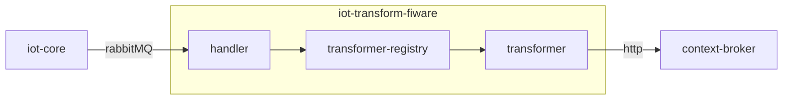

# iot-transform-fiware

A service for handling core functionality in the IoT platform

[](https://github.com/diwise/iot-agent/blob/main/LICENSE)

# Design 


```mermaid
flowchart LR
    iot-core--rabbitMQ-->handler
    transformer--http-->context-broker
    subgraph iot-transform-fiware
        handler-->transformer-registry-->transformer   
    end 
```

## Dependencies  
 - [iot-device-mgmt](https://github.com/diwise/iot-device-mgmt)
 - [RabbitMQ](https://www.rabbitmq.com/)
 - [Context Broker](https://github.com/diwise/context-broker)

## Transformers
Transformers purpose is to transform measurements into [Smart Data Models](https://smartdatamodels.org/) (FIWARE). Additional transformers could easily be developed using the context-broker client api and [decorator functions](https://github.com/diwise/context-broker/blob/main/pkg/ngsild/types/entities/decorators/decorators.go). 
### AirQualityObserved
[Specification](https://github.com/smart-data-models/dataModel.Environment/blob/master/AirQualityObserved/doc/spec.md)

An observation of air quality conditions at a certain place and time.
### IndoorEnvironmentObserved
[Specification](https://github.com/smart-data-models/dataModel.Environment/blob/master/IndoorEnvironmentObserved/doc/spec.md)

An observation of air and climate conditions for indoor environments.
### GreenspaceRecord
[Specification](https://github.com/smart-data-models/dataModel.ParksAndGardens/blob/master/GreenspaceRecord/doc/spec.md)

This entity contains a harmonised description of the conditions recorded on a particular area or point inside a greenspace (flower bed, garden, etc.).
### Device
[Specification](https://github.com/smart-data-models/dataModel.Device/blob/master/Device/doc/spec.md)

An apparatus (hardware + software + firmware) intended to accomplish a particular task (sensing the environment, actuating, etc.).
### Lifebuoy
[Specification]()

Custom Smart Data Model
### WeatherObserved
[Specification](https://github.com/smart-data-models/dataModel.Weather/blob/master/WeatherObserved/doc/spec.md)

An observation of weather conditions at a certain place and time. This data model has been developed in cooperation with mobile operators and the GSMA.
### WaterQualityObserved
[Specification](https://github.com/smart-data-models/dataModel.WaterQuality/blob/master/WaterQualityObserved/doc/spec.md)

Water Quality data model is intended to represent water quality parameters at a certain water mass (river, lake, sea, etc.) section
### WaterConsumptionObserved
[Specification](https://github.com/smart-data-models/dataModel.WaterConsumption/blob/master/WaterConsumptionObserved/doc/spec.md) 

 The Smart Water Meter model captures water consumption, customer side leak alarms and associated flow rate originating from the smart water meters

## Things

### Sewers
...

# Build and test
## Build
```bash
docker build -f deployments/Dockerfile . -t diwise/iot-transform-fiware:latest
```
## Test
Testing is best done using unit tests. For integration testing the preferred way is to use `docker-compose.yaml` found in repository [diwise](https://github.com/diwise/diwise) 

# Configuration

## Environment variables

```json
"RABBITMQ_HOST": "<rabbit mq hostname>"
"RABBITMQ_PORT": "5672"
"RABBITMQ_VHOST": "/"
"RABBITMQ_USER": "user"
"RABBITMQ_PASS": "bitnami"
"RABBITMQ_DISABLED": "false"
"NGSI_CB_URL":"<http://context-broker>"
```
## CLI flags
 - `loglevel` - Set the log level (overrides `LOG_LEVEL`)

## Configuration files
none

## Faktisk konfiguration (kod ar facit, HARM-002)
Precedens: default < miljovariabel < CLI-flagga. RabbitMQ konfigureras i ovrigt via `messaging.LoadConfiguration`.

| Variabel | Default | Notering |
| --- | --- | --- |
| `LISTEN_ADDRESS` | `0.0.0.0` | Galler kontrollservern |
| `CONTROL_PORT` | `8000` | Kontrollserver: pprof, liveness, `rabbitmq`-stubb som returnerar OK |
| `NGSI_CB_URL` | `http://context-broker` |  |
| `OAUTH2_TOKEN_URL` | (tom) | Utan fullstandiga OAuth-uppgifter skapas context-broker-klient utan token |
| `OAUTH2_CLIENT_ID` | (tom) |  |
| `OAUTH2_CLIENT_SECRET` | (tom) |  |
| `OAUTH2_REALM_INSECURE` | `true` | Endast exakt `true` stanger av TLS-verifiering |
| `LOG_LEVEL` | `debug` | Enda CLI-flaggan ar `-loglevel` |
| `RABBITMQ_HOST` | (tom, kravs om inte avstangd) | Se `messaging.LoadConfiguration` |
| `RABBITMQ_PORT` | `5672` |  |
| `RABBITMQ_VHOST` | `/` |  |
| `RABBITMQ_USER` | `user` |  |
| `RABBITMQ_PASS` | `bitnami` |  |
| `RABBITMQ_DISABLED` | `false` |  |
| `RABBITMQ_INIT_TIMEOUT` | `10` | Sekunder |

Health paths pa kontrollservern (`CONTROL_PORT`): `/health`, `/healthz`, `/livez`, `/readyz`, `/readyz/{check}`.

Konsumerar `thing.updated` (filtrerat per content type) och `message.accepted`. Ingen `message.transformed` publiceras i nulaget.

Extern paverkan (BASE-002): imagen exponerar kontrollporten (`EXPOSE 8000`) eftersom tjansten saknar publik server. Externa Kubernetes- och Compose-definitioner ska anvanda kontrollporten for health-prober.

Extern paverkan (PILOT-003): den doda `SERVICE_PORT`-konfigurationen ar borttagen eftersom tjansten saknar publik server. Att satta `SERVICE_PORT` har inte langre nagon effekt; ta bort variabeln ur externa deploymentdefinitioner.
# Harmoniseringspilot (PILOT-004)

Denna tjanst var pilot for harmoniseringen mot malstrukturen
`cmd/<tjanst>` + `internal/{application,infrastructure,presentation}`.
Slutstruktur:

```text
cmd/iot-transform-fiware
internal/application/{decorators,measurements,things}
internal/infrastructure/contextbroker
internal/presentation/messaging/{measurements,things}
```

## Monster att ateranvanda

- Privat `flagType`, `flagMap` och `appConfig` i `cmd`, med precedensen default < env < CLI-flagga.
- `servicerunner` med kontrollserver, liveness och namngivna readiness-stubbar som returnerar OK.
- Felreturnerande `initialize` och felkontrollerad handlerregistrering; endast `main` avgor exitkod.
- Outbound-adaptrar (context-broker-klient, OAuth-fabrik, merge/create) i `internal/infrastructure`.
- Inkommande RabbitMQ-adaptrar i `internal/presentation/messaging`: envelopeavkodning och brokeranrop, med transformationer och applikationsagda portar (`TransformerFor`, `EntityWriter`) i `internal/application`.
- Karakteriseringstester for kontrakt, config och lifecycle; verifiering med `gofmt`, `go test ./...`, `go vet ./...`, `go build ./cmd/...` och Dockerbygge.

## Att inte kopiera

- Tjansten saknar publik server (ingen `servicePort`); API-tjanster ska ha separat publik server pa `SERVICE_PORT`.
- Presentation far importera bade `internal/application` och `internal/infrastructure`; `internal/application` far inte importera `internal/infrastructure`.
- `FunctionUpdatedTopic`-konstanten i `cmd` ar deklarerad men oanvand lamnad kvarstand.

# Links
[iot-transform-fiware](https://diwise.github.io/) on diwise.github.io
